# Library-2.0

Application for library management. On this project I used such technology stack: Spring Core, Spring MVC, Hibernate and
Spring Data JPA. Also, I used PostgreSQL as Data Base.

## Task:

The local library wants to switch to digital accounting of books. You need to develop a web application for them.
Librarians should be able to register readers, lend books to them, and free books (after the reader returns the book to
the library).

## Entity:

Person (fields: Full name (UNIQUE), year of birthday)  
Book (fields: name, author, year)  
Relationship between entities: One to Many.  
Person can have many books. The book may belong only one person.
In DB must be two tables - Person and Book. For all tables
set automatically generation of id.

## Necessary functions:

1) Pages for creating, updating and deleting person.
2) Pages for creating, updating and deleting book
3) Page with list of all people (people are clickable - after click on person it must redirect to page with info about
   this person).
4) Page with list of all books (books are clickable - after click on book it must redirect to page with info about this
   book).
5) Page of person which show all values of him fields and list of books which he took. If person doesn't take any book,
   it must print text "He hasn't taken book yet".
6) Page of book which show all values of book's fields and full name of person who took this book. If book isn't taken,
   it must print text "This book is free".
7) If somebody takes book, on book's page near person's name must be "Free book" button. This button is knocked by
   librarian when person bring this book back, book become free and deleting from person's list of books.
8) On the page of the book, if the book is free, there should be a drop-down list (select) with all people and the "
   Choose person" button. This button is pressed by the librarian when the person wants to take this book home. The book
   must be included in the list of person's book.
9) All fields must validate with @Valid and @Spring Validator, if it's necessary.
10) Add pagination for books. There may be many books and they may not fit on one page, so it must be dropped on
    different pages (for test 2 books on one page).
11) Sorting for books by their year of publication.
12) Page for searching books. Enter in field first letters of book's name and it must show list of suitable books (it
    must show book's name, author's full name and person's full name whom had taken this book).
13) Add checking if someone missed the deadline of returning book (5 days).

## Screenshots of pages

### Page with list of all peoples (url: /people)

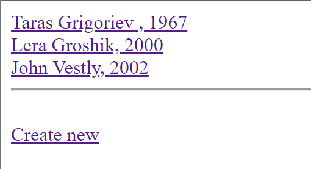

### Page for creating new person (url: /people/new)

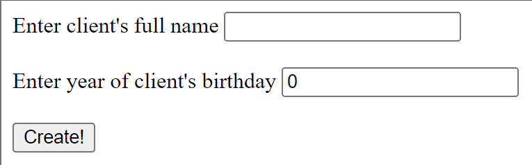

### Page for updating person (url: /people/{id}/edit)

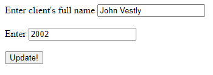

### Page with list of books with pagination (utl: /books)
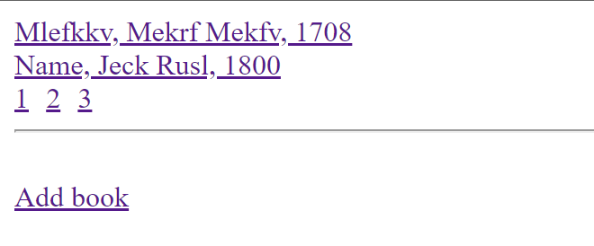

### Page for creating new book (url: /books/new)

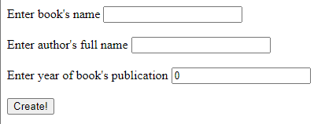

### Page for updating book (url: /books/{id}/edit)

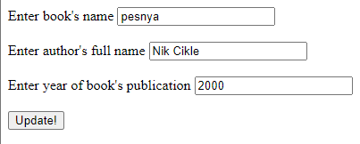

### Page for info about person (url: /person/{id})

Person who didn't take book  
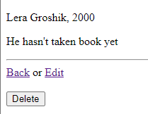  
Person who took book  
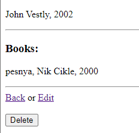  

### Page for info about book (url: /books/{id})

Book in library and free  
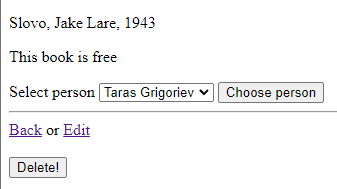  

Choosing person  
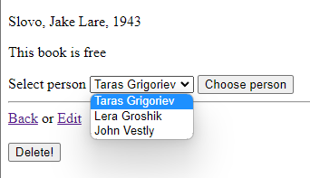  

Person took this book  
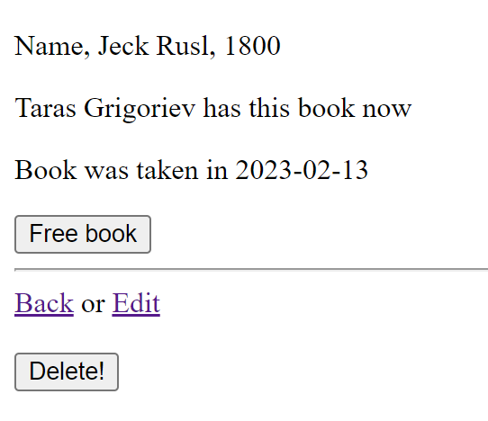

Person took this book and missed deadline
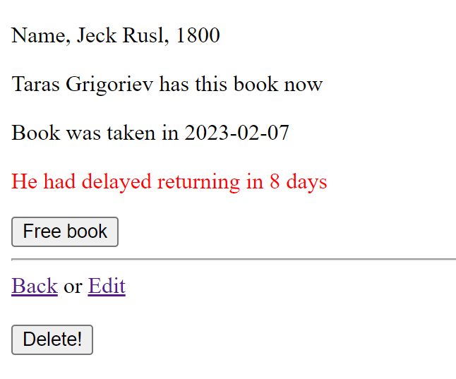

### Page for searching book

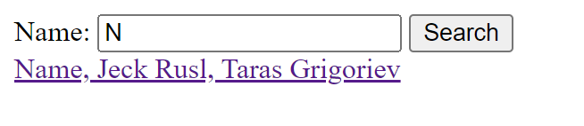

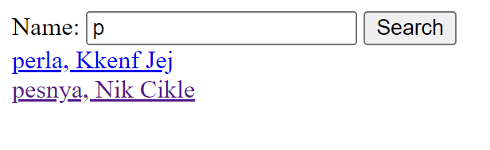
